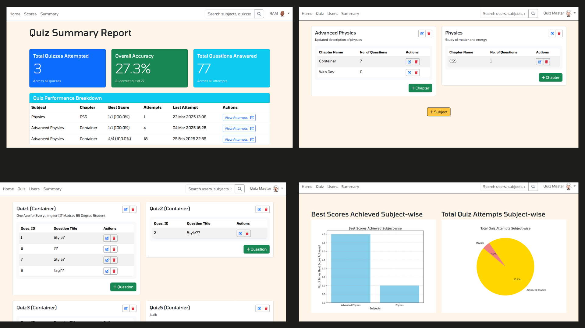

# Quiz Master

Quiz Master is a web-based application designed to manage quizzes, track user performance, and provide insightful analytics for administrators. It allows users to attempt quizzes, view their scores, and analyze their performance, while administrators can manage quizzes, users, and view summary reports.

---

## Features


### User Features
- **Search Functionality**: Search for quizzes, subjects, and chapters.
- **Quiz Attempts**: Attempt quizzes and view detailed results.
- **Performance Tracking**: View overall accuracy, total quizzes attempted, and total questions answered.
- **User Profile**: Manage personal details.

### Admin Features
- **User Management**: Add, edit, and delete users.
- **Quiz Management**: Add, edit, and delete quizzes, chapters, and subjects.
- **Summary Reports**: View graphical reports of quiz performance, including:
  - Best scores achieved subject-wise (Bar Chart).
  - Total quiz attempts subject-wise (Pie Chart).

---

## Technologies Used

- **Backend**: Flask (Python)
- **Frontend**: HTML, CSS, Bootstrap, Jinja2 Templates
- **Database**: SQLAlchemy (SQLite)
- **Charts**: Matplotlib
- **Authentication**: Flask-Login

---

## Installation

1. Clone the repository:
   ```bash
   git clone https://github.com/23f3004131/quiz_master_23f3004131.git
   cd quiz_master_23f3004131
    ```
2. Create a virtual environment and activate it:
    ```bash
    python -m venv venv
    ven\Scripts\activate
     ```
3. Install the required dependencies:
    ```bash
    pip install -r requirements.txt
    ```
4. Run the application:
    ```bash
    python app.py
    ```
5. Open your browser and navigate to:
    ```bash
    http://127.0.0.1:5000/
    ```
---

## Project Structure

```bash
quiz_master/
│
├── static/                 # Static files (CSS, images)
│   ├── styles/             # CSS files
│   ├── images/             # Generated charts and other images
│
├── templates/              # HTML templates
│   ├── chapter/            # Chapter-specific templates
│       ├── add.html        # Add chapter
│       ├── edit.html       # Edit chapter
│   ├── question/           # Question-specific templates
│       ├── add.html        # Add question
│       ├── edit.html       # Edit question
│   ├── quiz/               # Quiz-specific templates
│       ├── add.html        # Add quiz
│       ├── edit.html       # Edit quiz
│       ├── attempt.html    # Attempt quiz
│       ├── detail.html     # Quiz details
│       ├── home.html       # Quiz home
│       ├── result.html     # Quiz result
│       ├── summary.html    # Quiz summary
│   ├── subject/            # Subject-specific templates
│       ├── add.html        # Add subject
│       ├── edit.html       # Edit subject
│   ├── user/               # User-specific templates
│       ├── search.html     # Search results
│       ├── summary.html    # Summary reports
│       ├── users.html      # User management
│   ├── admin.html          # Admin dashboard
│   ├── index.html          # Home page
│   ├── layout.html         # Base layout
│   ├── login.html          # Login page
│   ├── navbar.html         # Navigation bar
│   ├── profile.html        # User profile
│   ├── register.html       # Registration page
│   ├── scores.html         # Quiz score
│   ├── search.html         # Search results
│   ├── summary.html        # Summary reports
│
├── .gitignore              # Git ignore file
├── .env                    # Environment variables
├── app.py                  # Main application entry point
│── api.py                  # API routes
├── routes.py               # Application routes
├── models.py               # Database models
├── README.md               # Project documentation
├── requirements.txt        # Python dependencies
└── config.py               # Application configuration
```